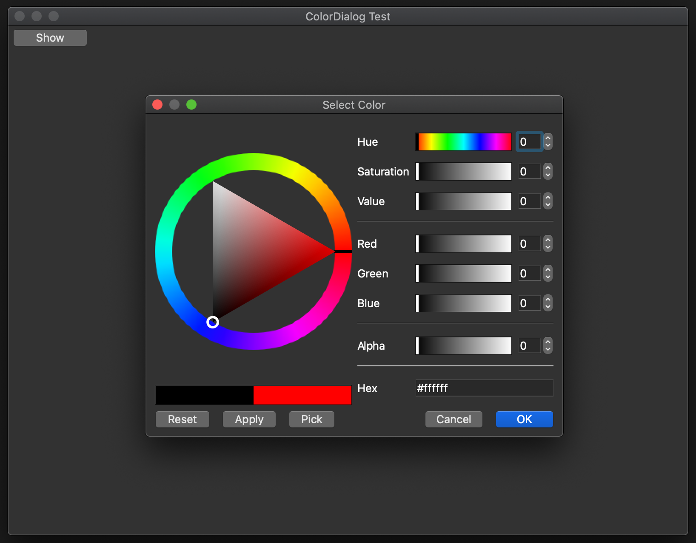

# ColorDialog

A color dialog to provide a better user experience than QColorDialog



## Building

MacOS X:

```
brew install qt
mkdir build
cd build
cmake -DQt5_DIR=$(brew --prefix qt5)/lib/cmake/Qt5 ..
make -j12
```

## License

LGPLv3+, See COPYING.
As a special exception, this library can be included in any project under the
terms of any of the GNU liceses, distributing the whole project under a
different GNU license, see LICENSE-EXCEPTION for details.

Copyright (C) 2013-2020 Mattia Basaglia <dev@dragon.best>
